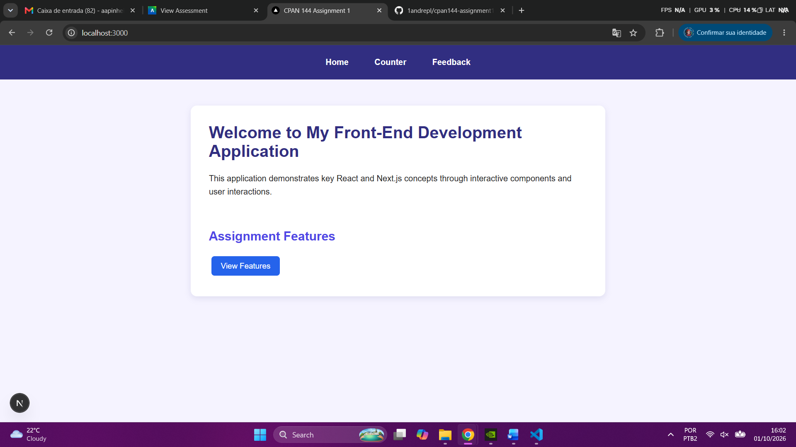
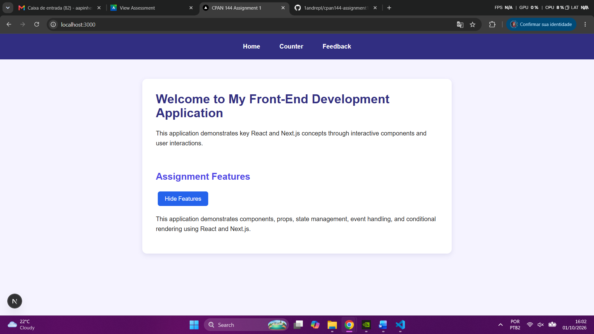
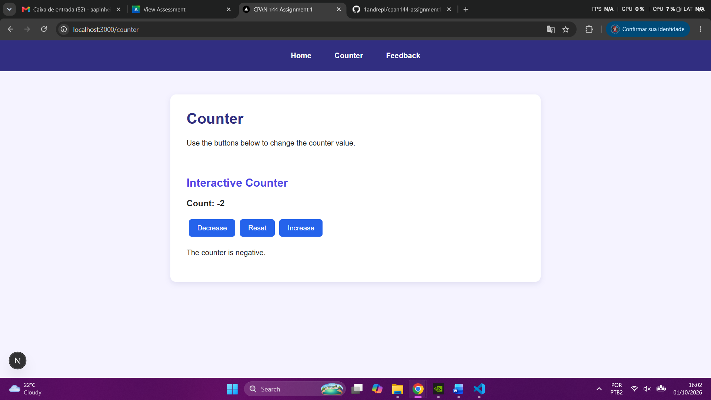
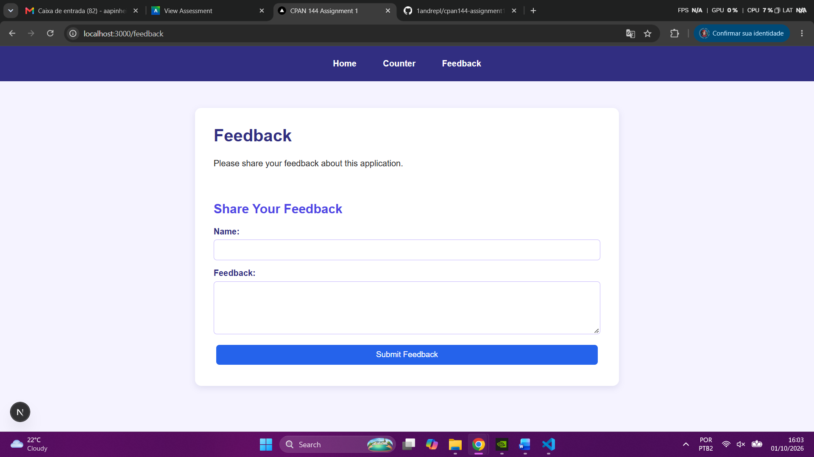
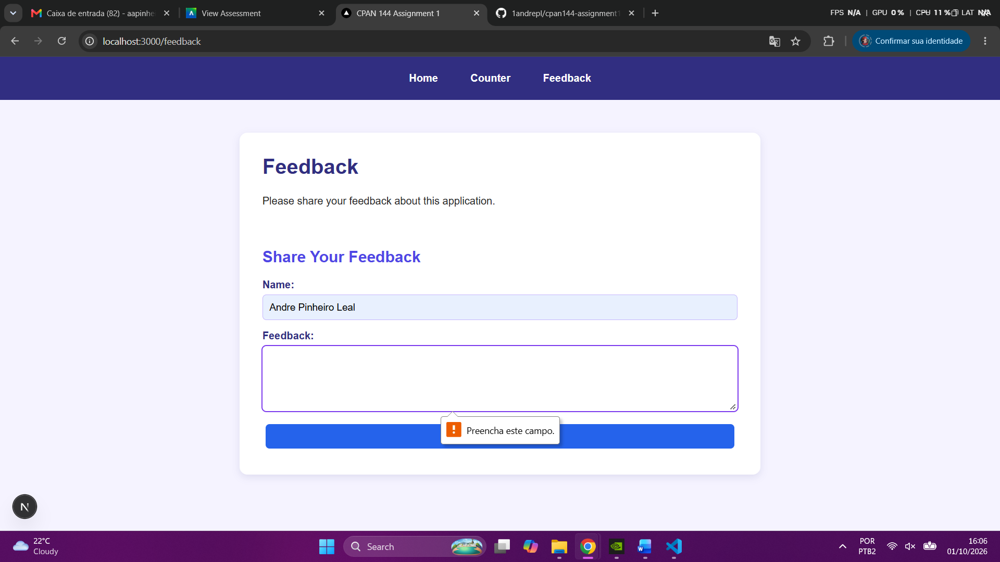
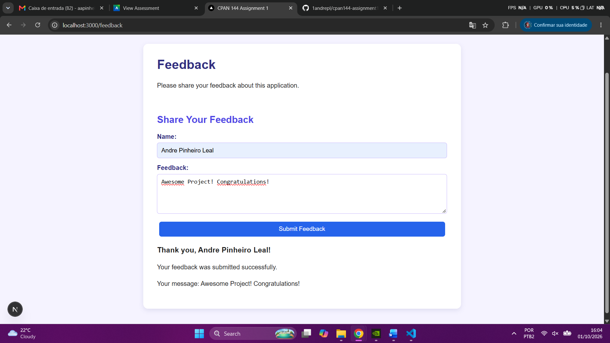

# CPAN 144 Assignment 1

React and Next.js application created for CPAN 144.

## Features

- Home page with navigation
- Counter with state and button events
- Feedback form with form submission
- Props between components
- Conditional rendering
- CSS styling

## Technologies

- React
- Next.js
- TypeScript
- CSS

## Run the Project

```bash
npm install
npm run dev
```

## Screenshots

### Home - View Features


### Home - Hide Features


### Counter - Increase


### Counter - Decrease


### Counter - Reset


### Feedback Form - Fill


### Feedback Form - Required Field


### Feedback Form - Submitted
